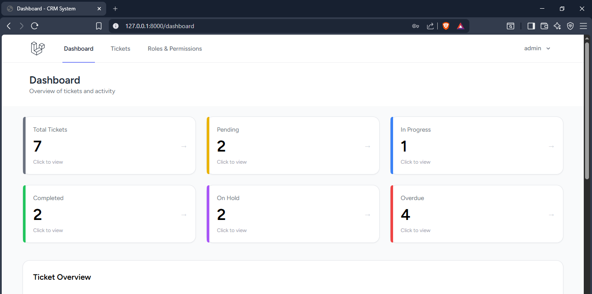
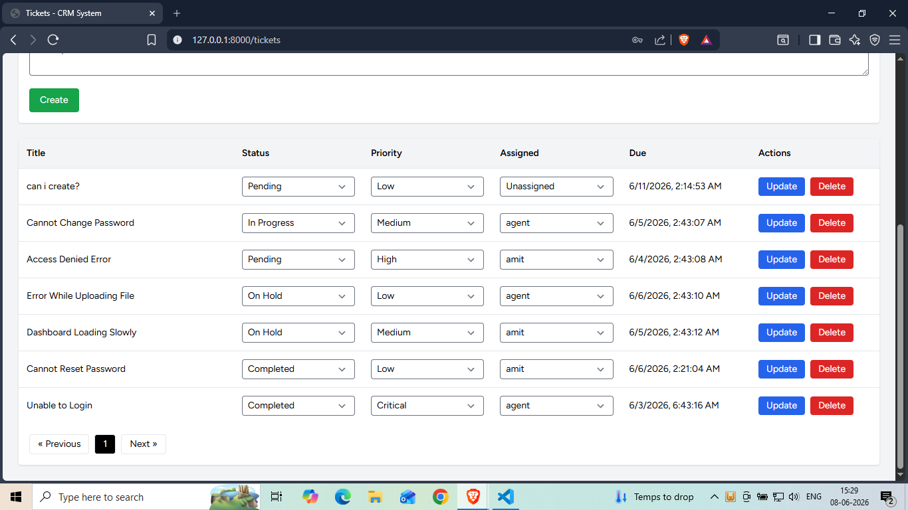
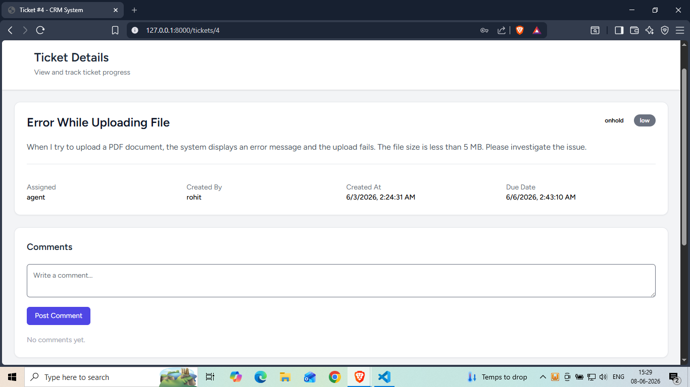
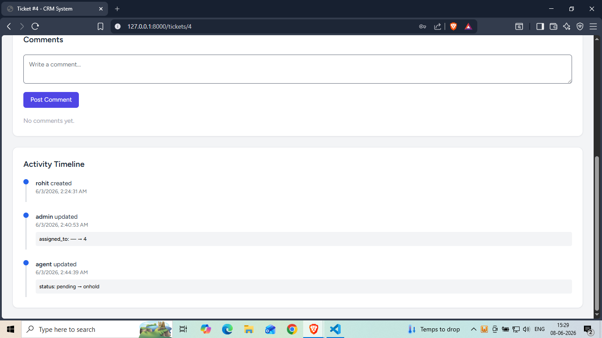
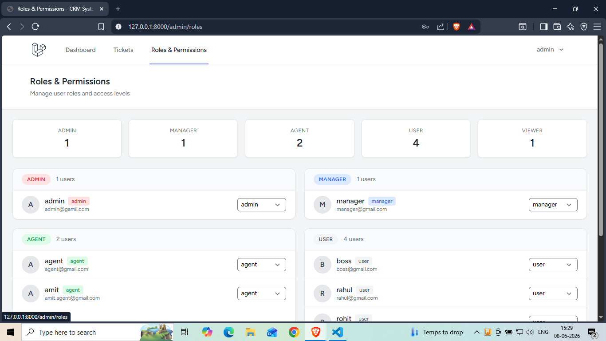

# CRM System

A full-stack, role-based Customer Relationship Management (CRM) system built with **Laravel 12**, **React 18**, **Inertia.js**, and **Vite**. Designed for support teams to manage tickets, track issues, and collaborate through threaded comments — with a role-based permission system controlling exactly what each user can see and do.

---

## Screenshots

### Dashboard



### Ticket Management



### Ticket Details



### Comments & Activity Timeline



### Roles & Permissions



---

## Tech Stack

| Layer | Technology |
|---|---|
| Backend Framework | Laravel 12 |
| Frontend Framework | React 18 |
| SPA Bridge | Inertia.js v2 |
| Build Tool | Vite 7 |
| Styling | Tailwind CSS v3 |
| Charts | Recharts |
| UI Components | Headless UI |
| Auth Scaffold | Laravel Breeze |
| Database | SQLite (default) / MySQL |
| Authorization | Laravel Policies |
| PHP Version | 8.2+ (8.4 recommended) |

---

## Features

### Role-Based Access Control
Five distinct roles with granular permissions enforced at the policy level:

| Role | Description |
|---|---|
| `admin` | Full access — manage users, roles, tickets, priorities, and assignments |
| `manager` | Manage and assign tickets, update priorities, view all tickets |
| `agent` | View and work on assigned tickets, update status, add comments |
| `user` | Create tickets, view own tickets, add comments |
| `viewer` | Read-only access to all tickets and the global dashboard |

### Ticket Management
- Create tickets with title and description
- Automatic priority assignment with SLA-based due dates
- Update ticket status inline from the ticket list
- Managers and admins can reassign tickets and change priority from the list
- Click any ticket row to open the full detail view
- Delete tickets (own tickets for users, any ticket for admins)
- Overdue detection for tickets past their due date

### Ticket Statuses & Priorities
Statuses: `pending` · `inprogress` · `completed` · `onhold`

Priorities: `low` · `medium` · `high` · `critical`

### Search & Filtering
- Full-text search across ticket title and description
- Filter by status, priority, assigned agent, or overdue
- Filters persist across pagination
- Reset all filters with one click

### Pagination
- 10 tickets per page with query string preserved across pages

### Dashboard Analytics
Role-aware dashboard with stat cards (all clickable, linking to filtered ticket views) and a bar chart showing ticket distribution by status.

### Threaded Comments
- Authenticated users can comment on tickets they can access
- Comments displayed chronologically with avatar, name, and timestamp
- Comment activity logged to the activity timeline

### Activity Timeline
Full audit log on every ticket — tracks status changes, priority changes, assignments, and comments with old → new value diffs and timestamps.

### Admin Panel — Role Management
- Admin-only page at `/admin/roles`
- View all users grouped by role
- Change any user's role instantly via dropdown

### User Profile
- Update name, email, and password
- Delete account

---

## Role Permissions

| Action | Admin | Manager | Agent | User | Viewer |
|---|:---:|:---:|:---:|:---:|:---:|
| View ticket list | ✅ | ✅ | ✅ | ✅ | ✅ |
| View ticket detail | ✅ | ✅ | if assigned | if created | ✅ |
| Create ticket | ✅ | ✅ | ✅ | ✅ | ❌ |
| Update status | ✅ | ✅ | if assigned | ❌ | ❌ |
| Update priority | ✅ | ✅ | ❌ | ❌ | ❌ |
| Assign ticket | ✅ | ✅ | ❌ | ❌ | ❌ |
| Delete ticket | ✅ | ❌ | ❌ | if created | ❌ |
| Add comment | ✅ | ✅ | ✅ | ✅ | ❌ |
| Manage user roles | ✅ | ❌ | ❌ | ❌ | ❌ |

---

## Project Structure

```
crm-system/
├── app/
│   ├── Http/Controllers/
│   ├── Http/Middleware/
│   ├── Models/
│   └── Policies/
├── database/
│   ├── migrations/
│   └── seeders/
├── resources/
│   └── js/Pages/
│       ├── Admin/
│       ├── Auth/
│       ├── Profile/
│       └── Tickets/
└── routes/
```

---

## Installation

### Prerequisites
- PHP >= 8.2 (8.4 recommended)
- Composer
- Node.js >= 18 + npm

### Steps

```bash
git clone https://github.com/shivam-naithani/crm-system.git
cd crm-system

composer install
npm install

cp .env.example .env
php artisan key:generate

php artisan migrate --seed

npm run dev
# In a second terminal:
php artisan serve
```

Open [http://127.0.0.1:8000](http://127.0.0.1:8000)

> **Quick start:** `composer run setup` runs install → env setup → migrate → npm build in one command.

---

## Demo Credentials

All accounts use the password `password`:

| Role | Email |
|---|---|
| Admin | `admin@crm.com` |
| Manager | `priya.manager@crm.com` |
| Manager | `rohan.manager@crm.com` |
| Agent | `sneha.agent@crm.com` |
| Agent | `amit.agent@crm.com` |
| Agent | `kiran.agent@crm.com` |
| Customer | `neha@customer.com` |
| Customer | `vikram@customer.com` |
| Customer | `deepa@customer.com` |
| Customer | `rahul@customer.com` |
| Viewer | `meera.viewer@crm.com` |

To reset demo data at any time:
```bash
php artisan migrate:fresh --seed
```

---

## Future Enhancements

- [ ] Email notifications for ticket updates
- [ ] File attachments on tickets
- [ ] Real-time notifications (Laravel Echo + Reverb)
- [ ] Two-factor authentication (2FA)
- [ ] Export tickets to CSV / Excel
- [ ] Dark mode
- [ ] REST API for mobile clients

---


## License

This project is open-source and available under the [MIT License](LICENSE).
